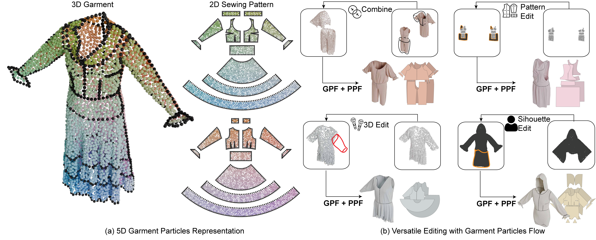

# Garment Particles: A 2D–3D Symmetric Garment Representation for Generation and Editing

Official codebase for the SIGGRAPH Conference Papers 2026 paper _Garment Particles: A 2D–3D Symmetric Garment Representation for Generation and Editing_.

[Project page](https://garment-particles.github.io)



---

Diffusion-based garment generation. A **two-stage pipeline** generates a garment
as a 3D particle cloud (stage 1 — the *particle generative function*, PGF) and
then reconstructs its sewing pattern (stage 2 — the *edge model*). Three
conditioning modes are supported:

- **Text / unconditional**
- **Image** — conditioned on a single rendered garment image (GarmentCodeData-v2)
- **Sketch** — conditioned on a line-art drawing

---

## Installation

```bash
conda create -n interact_garment python=3.10
conda activate interact_garment

pip install torch torchvision                  # tested with torch >=2.4, CUDA 12.x
pip install -r src/requirements.txt
pip install flash-attn --no-build-isolation    # optional; may need to build from source

# add src/ to the Python import path (run from the repo root)
export PYTHONPATH=$PWD/src:$PYTHONPATH
```

The Earth Mover's Distance CUDA extension must be built against your
torch/CUDA:

```bash
cd external/PyTorchEMD
python setup.py build_ext --inplace
cd ../..
```

---

## Repository layout

```
src/
├── inference/infer_twostage.py   two-stage inference entry point
├── train_fsdp2.py                training entry point (all models, FSDP2)
├── models/                       PGF + edge model architectures
├── datasets/                     particle & edge datasets
├── configs/                      Hydra configs
├── patterns/pattern_packing.py   standalone semantic 2D panel packing
├── utils/stage1_particles.py     atomic stage-one HDF5 writer
└── transport/                    diffusion transport and integrators
```

---

## Standalone pattern packing

The semantic panel packer is first-party code and does not import or require
GarmentCode. It accepts NumPy panel geometry and any tree-like hierarchy whose
nodes expose `name`, `parent`, and `children`:

```python
import numpy as np

from patterns.pattern_packing import (
    PackingPanel,
    load_panel_hierarchy,
    pack_pattern_panels,
)

vertices = np.array([[0, 0], [1, 0], [1, 1], [0, 1]])
boundary_indices = [0, 1, 2, 3]
panels = [PackingPanel("left_ftorso", vertices, boundary_indices)]
result = pack_pattern_panels(
    panels,
    load_panel_hierarchy(),
    strategy="fine_to_coarse",
    padding=3.0,
)
```

`result.panel_vertices`, `result.boundaries`, and `result.offsets` contain the
packed output. The only direct runtime dependencies of the packer are NumPy
and Shapely. The related `utils.stage1_particles.write_stage1_particles`
helper writes packed 2D coordinates plus simulated 3D coordinates to the HDF5
schema consumed by the stage-one datasets.

Note that the packing result might differ from the released dataset. For reproduction, please use the packed result from the dataset. 

---

## Pre-trained models

Download the checkpoints into `src/checkpoints/`. Each is a Distributed
Checkpoint (DCP) **directory**.

| Model        | Role                       | Path                        |
|--------------|----------------------------|-----------------------------|
| PGF — text   | stage 1, text/unconditional | `src/checkpoints/pgf_text`   |
| PGF — image  | stage 1, GCDv2 image        | `src/checkpoints/pgf_image`  |
| PGF — sketch | stage 1, line-art           | `src/checkpoints/pgf_sketch` |
| Edge model   | stage 2 (shared)            | `src/checkpoints/edge`       |

Download all four from the model repo:

```bash
hf download georgeNakayama/GarmentParticles --local-dir src/checkpoints
```

---

## Dataset

The garment-particle dataset lives in a separate
[Hugging Face dataset repo](https://huggingface.co/datasets/georgeNakayama/GarmentParticles) —
`georgeNakayama/GarmentParticles` with `--repo-type dataset` (same name as the
model repo, different type):

- `data/particles-*.tar` — 26 shards of per-garment particle data
  (`rand_<id>/garment_particles_rand_<id>.h5` + `stats.txt`)
- `short_captions_v2.json` — short design-attribute captions keyed by
  `rand_<id>`
- `data/panel_edge_vecs.tar` — edge-model targets and panel transformations
  (`panel_edge_vecs_<id>.npz` + `transformations_11182025.json`)
- `splits/garment_particle_v2_{train,test}_11182025.txt` — train / test splits

The captions and panel-edge vectors are project-derived metadata, not files
from the official GarmentCodeData-v2 download. The captions were generated
from each garment's `*_design_params.yaml`; the edge vectors were generated
from its sewing-pattern specification. Both cover every garment in the
released train and test splits. The edge metadata is distributed as one tar
archive to avoid creating more than 100,000 individual files in the dataset
repository.

Download and unpack the complete dataset:

```bash
hf download georgeNakayama/GarmentParticles --repo-type dataset --local-dir garment_data
for t in garment_data/data/particles-*.tar; do tar -xf "$t" -C garment_data; done
tar -xf garment_data/data/panel_edge_vecs.tar -C garment_data
```

If the particle shards are already present, download just the newly released
metadata instead:

```bash
hf download georgeNakayama/GarmentParticles \
  short_captions_v2.json data/panel_edge_vecs.tar \
  --repo-type dataset --local-dir garment_data
tar -xf garment_data/data/panel_edge_vecs.tar -C garment_data
```

The resulting layout is:

```text
garment_data/
├── rand_<id>/
│   └── garment_particles_rand_<id>.h5
├── panel_edge_vecs/
│   └── rand_<id>/
│       ├── panel_edge_vecs_rand_<id>.npz
│       └── transformations_11182025.json
├── short_captions_v2.json
└── splits/
```

Put the split files where the configs expect them and define reusable absolute
paths from the repository root:

```bash
cp garment_data/splits/*.txt src/assets/
export GP_DATA_ROOT="$(realpath garment_data)"
export GCDV2_ROOT=/absolute/path/to/garmentcodedatav2
# Required only for sketch-conditioned runs:
export LINEART_ROOT=/absolute/path/to/gcdv2_lineart/images
```

The commands below pass these paths as Hydra overrides, so the machine-specific
defaults in `src/configs/dataset/` do not need to be edited. In particular:

- Caption-conditioned PGF runs use
  `dataset.text_path=$GP_DATA_ROOT/short_captions_v2.json`.
- Edge-model training and two-stage evaluation use
  `dataset.garment_edge_dir=$GP_DATA_ROOT/panel_edge_vecs` and the included
  `transformations_11182025.json` files.
- Particle-only paths are `dataset.data_dir=$GP_DATA_ROOT` for PGF training and
  `dataset.garment_particle_dir=$GP_DATA_ROOT` for the edge dataset.

**GarmentCodeData-v2** (rendered garment images + sewing-pattern specs) is *not*
included here. Download it from the official source for image-conditioned runs
and for the sewing-pattern specifications used by edge training/evaluation.
`GCDV2_ROOT` must directly contain the `garments_5000_*/` directories referenced
by `src/assets/gcd_list.txt`. This is a data dependency only; the GarmentCode
Python package is not required.

---

## Inference

All modes run through `inference/infer_twostage.py`. Export the dataset paths as
shown above, then run from `src/`. The current two-stage evaluation dataset uses
the released particles, captions, edge targets, transformations, and GCDv2
specifications, including for text/unconditional sampling.

```bash
cd src
```

### Text-conditioned / unconditional

```bash
torchrun --standalone --nproc_per_node=1 inference/infer_twostage.py \
  eval.sample_per_batch=1 eval.n_samples=0 eval.evaluate=False \
  train.exp_name=text_cond_samples sample.num_sampling_steps=100 \
  gpf_ckpt=null \
  dataset.garment_particle_dir="$GP_DATA_ROOT" \
  dataset.garment_edge_dir="$GP_DATA_ROOT/panel_edge_vecs" \
  dataset.text_path="$GP_DATA_ROOT/short_captions_v2.json" \
  dataset.gcd_dir="$GCDV2_ROOT" \
  dataset.front_only=True dataset.use_all_captions=True \
  dataset.img_drop_prob=1 dataset.text_drop_prob=0 \
  model.use_qknorm=True \
  edge_model.use_qknorm=True \
  edge_model_ckpt=checkpoints/edge \
  model=sparse_lightningdit_v3_xl1_w_text_fsdp2 \
  pgf_weight_init=checkpoints/pgf_text \
  --config-name sparselightningdit_xl_garment_particle_inference
```

For unconditional sampling, use the same command with
`dataset.text_drop_prob=1 train.exp_name=uncond_samples`.

### Image-conditioned (GCDv2)

```bash
torchrun --standalone --nproc_per_node=1 inference/infer_twostage.py \
  eval.sample_per_batch=1 eval.n_samples=0 eval.evaluate=False \
  train.exp_name=img_cond_samples sample.num_sampling_steps=100 \
  gpf_ckpt=null \
  dataset.garment_particle_dir="$GP_DATA_ROOT" \
  dataset.garment_edge_dir="$GP_DATA_ROOT/panel_edge_vecs" \
  dataset.text_path="$GP_DATA_ROOT/short_captions_v2.json" \
  dataset.gcd_dir="$GCDV2_ROOT" \
  dataset.front_only=True dataset.use_all_captions=True \
  dataset.img_drop_prob=0 dataset.text_drop_prob=1 \
  model.use_qknorm=True model.use_rope=False model.in_channels=6 model.freeze_everything=False \
  edge_model.use_qknorm=True \
  edge_model_ckpt=checkpoints/edge \
  model=sparse_lightningdit_v3_xl1_w_img_text_v2 \
  pgf_weight_init=checkpoints/pgf_image \
  --config-name sparselightningdit_xl_garment_particle_inference
```

### Sketch-conditioned (line-art)

Same as the image command, with the line-art dataset and the sketch PGF:

```bash
torchrun --standalone --nproc_per_node=1 inference/infer_twostage.py \
  eval.sample_per_batch=1 eval.n_samples=0 eval.evaluate=False \
  train.exp_name=lineart_cond_samples sample.num_sampling_steps=100 \
  gpf_ckpt=null \
  dataset=garment_edges_v2.2_w_img_text_lineart \
  dataset.garment_particle_dir="$GP_DATA_ROOT" \
  dataset.garment_edge_dir="$GP_DATA_ROOT/panel_edge_vecs" \
  dataset.text_path="$GP_DATA_ROOT/short_captions_v2.json" \
  dataset.gcd_dir="$GCDV2_ROOT" dataset.image_root="$LINEART_ROOT" \
  dataset.front_only=True dataset.use_all_captions=True \
  dataset.img_drop_prob=0 dataset.text_drop_prob=1 \
  model.use_qknorm=True model.use_rope=False model.in_channels=6 model.freeze_everything=False \
  edge_model.use_qknorm=True \
  edge_model_ckpt=checkpoints/edge \
  model=sparse_lightningdit_v3_xl1_w_img_text_v2 \
  pgf_weight_init=checkpoints/pgf_sketch \
  --config-name sparselightningdit_xl_garment_particle_inference
```

Results are written to `outputs/<exp_name>/<date>/<time>/samples_*/` — generated
point clouds (`.ply`), renders (`.png`), and reconstructed sewing-pattern panels
(`.npz`).

### Evaluation on the released test split

The inference config reads
`assets/garment_particle_v2_test_11182025.txt`. In any command above, set
`eval.evaluate=True` to calculate panel, edge, stitch, and pattern-IoU metrics
against the released ground truth. `eval.n_samples=0` evaluates all 1,024 test
garments; use a positive value for a smaller smoke test. Keep all four common
dataset overrides (`garment_particle_dir`, `garment_edge_dir`, `text_path`, and
`gcd_dir`) when evaluation is enabled.

---

## Training

`train_fsdp2.py` is the single, config-driven entry point for **all** models
(FSDP2; launch with `torchrun`, set `--nproc_per_node` to your GPU count).
It instantiates both the training and validation splits, so the same command-line
dataset overrides configure both. Run these commands from `src/` after defining
`GP_DATA_ROOT`, `GCDV2_ROOT`, and, when needed, `LINEART_ROOT` above.

### PGF — text

```bash
torchrun --nproc_per_node=8 train_fsdp2.py \
  dataset.data_dir="$GP_DATA_ROOT" \
  dataset.text_path="$GP_DATA_ROOT/short_captions_v2.json" \
  model.use_qknorm=True \
  --config-name sparselightningdit_xl_garment_particle_v2.2_w_text_fsdp2
```

### PGF — image

Fine-tuned from the text PGF (`train.weight_init`):

```bash
torchrun --nproc_per_node=8 train_fsdp2.py \
  dataset.data_dir="$GP_DATA_ROOT" \
  dataset.text_path="$GP_DATA_ROOT/short_captions_v2.json" \
  dataset.gcd_dir="$GCDV2_ROOT" \
  model=sparse_lightningdit_v3_xl1_w_img_text_v2 \
  model.use_qknorm=True model.freeze_everything=False \
  dataset.pad_everything=False dataset.text_drop_prob=0.8 \
  data.sampler.target_tokens_per_batch=16382 \
  train.weight_init=checkpoints/pgf_text \
  --config-name sparselightningdit_xl_garment_particle_v2.2_w_img_text_fsdp2
```

### PGF — sketch

Same as image, with the line-art dataset:

```bash
torchrun --nproc_per_node=8 train_fsdp2.py \
  dataset=garment_particles_v2.2_w_img_text_lineart \
  dataset.data_dir="$GP_DATA_ROOT" \
  dataset.text_path="$GP_DATA_ROOT/short_captions_v2.json" \
  dataset.image_dir="$LINEART_ROOT" \
  model=sparse_lightningdit_v3_xl1_w_img_text_v2 \
  model.use_qknorm=True model.freeze_everything=False \
  dataset.pad_everything=False dataset.text_drop_prob=0.8 \
  data.sampler.target_tokens_per_batch=16382 \
  train.weight_init=checkpoints/pgf_text \
  --config-name sparselightningdit_xl_garment_particle_v2.2_w_img_text_fsdp2
```

### Edge model

Stage 2. Two architectures are provided — `varlen` (variable-length attention,
recommended) and the non-varlen baseline.

```bash
# varlen (recommended)
torchrun --nproc_per_node=8 train_fsdp2.py \
  dataset.garment_particle_dir="$GP_DATA_ROOT" \
  dataset.garment_edge_dir="$GP_DATA_ROOT/panel_edge_vecs" \
  dataset.gcd_dir="$GCDV2_ROOT" \
  train.global_batch_size=128 \
  dataset.predict_rigid_transformations=True \
  dataset.predict_attachment_type=True \
  dataset.predict_stitch_tags=True \
  dataset.predict_valid_mask=True \
  dataset.order_panels_by=3d \
  model.in_channels=15 +model.use_panel_embedding=False \
  model.use_qknorm=True model.use_rope=True \
  --config-name sparselightningdit_l_edges_v2.2_varlen_fsdp2

# non-varlen baseline: same overrides, swap the config name to
#   --config-name sparselightningdit_l_edges_v2.2_fsdp2
```
